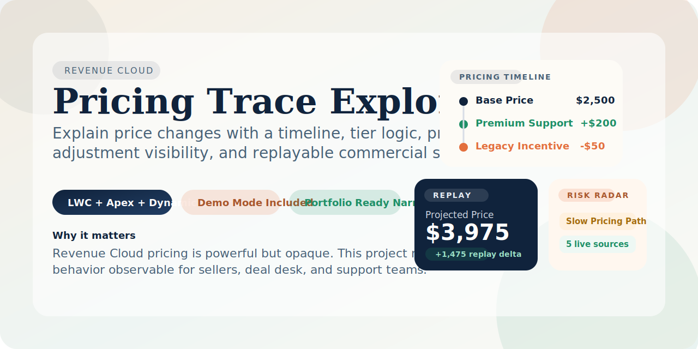
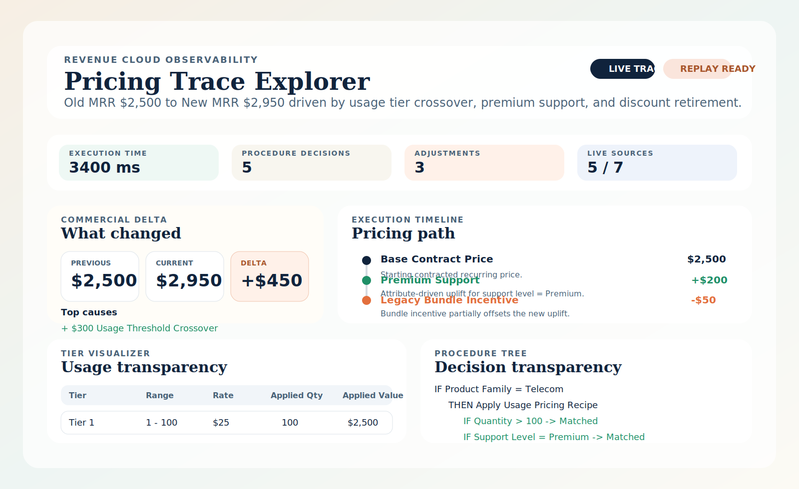
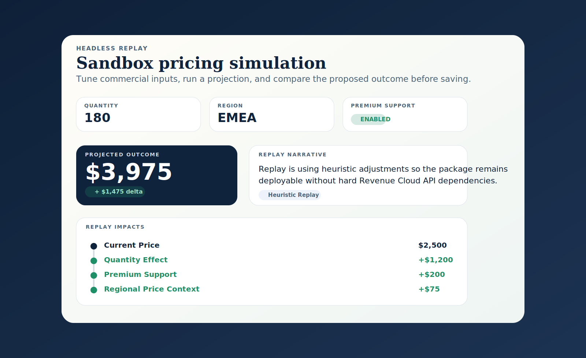
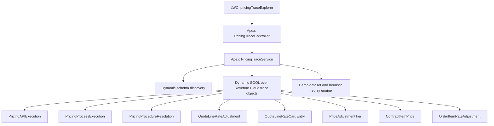

<p align="center">
  
</p>

<p align="center">
  <strong>Revenue Cloud pricing observability for quote, order, and amendment workflows.</strong>
</p>

<p align="center">
  
  
  
  
</p>

# Pricing Trace Explorer

This repo implements a portfolio-ready **Lightning Web Component + Apex service layer** for one of the most common Revenue Cloud pain points:

> sellers, deal desk, and support teams cannot easily explain why a price changed.

The component consolidates pricing execution, adjustments, tier logic, procedure decisions, and amendment-style deltas into one record-page experience. It is designed to be **safe to deploy in a generic org** while still becoming useful in a Revenue Cloud org through runtime object discovery.

Most sample Salesforce repos stop at CRUD screens. This one is intentionally closer to real architecture work:

- Solves a legitimate Revenue Cloud observability problem instead of another generic quote calculator.
- Uses a service contract and dynamic schema inspection so the package can compile without hard managed-package dependencies.
- Includes a recruiter-friendly demo mode for screenshots, demos, and portfolio walkthroughs.
- Preserves a path to real org integration with live trace objects and headless pricing replay.

## What it does

`Pricing Trace Explorer` can be dropped onto a record page or opened on an app/home page in demo mode.

It provides:

- A pricing timeline from baseline price to final net result.
- Adjustment cards that show source, impact direction, and override state.
- A tier visualizer for quantity/rate/value transparency.
- A procedure tree that makes pricing logic human-readable.
- A delta panel that frames the business impact like an amendment analysis.
- A replay console that simulates a headless repricing scenario without saving data.
- A source-health panel that explains which trace objects were actually reachable in the org.
- A risk radar for slow pricing paths, overlapping tiers, and ambiguous multi-execution traces.

## Screenshots

These are illustrated preview assets based on the shipped demo narrative, so the repo looks complete on GitHub before it is wired to a live org.

<p align="center">
  
  
</p>

## Share kit

If you are using this repo in applications, portfolio reviews, or LinkedIn posts, these files give you a reusable narrative:

- [Demo workflow](docs/promo/demo-workflow.md)
- [Application and LinkedIn copy](docs/promo/share-copy.md)


### 2-minute walkthrough

1. Open the component in demo mode and start with the summary banner.
2. Point to the commercial delta card and explain the business outcome first: old price, current price, and net delta.
3. Move to the timeline and narrate how the price changed step by step from base price to final result.
4. Open the adjustment and tier sections to show transparency into rule impacts and usage-based pricing.
5. Use the procedure tree to explain that the UI is not just cosmetic, it is exposing engine decision logic.
6. Open the replay console and show how a seller or analyst can simulate a pricing change before saving.
7. Close on the source-health and risk-radar panels to show operational thinking, not just UI construction.

## Architecture



### Design choices

- **No hard package dependency**: object and field access is resolved with `Schema.getGlobalDescribe()` and semantic field candidate lists.
- **Security-first**: `with sharing`, access checks on describes, and `Security.stripInaccessible(...)` on queried records.
- **Live + demo modes**: live mode uses discovered objects; demo mode guarantees a clean narrative for recruiter walkthroughs.
- **Heuristic replay**: the shipped replay is package-agnostic on purpose, but the service contract is already aligned to swap in a real headless pricing call later.

## Repo layout

```text
force-app/main/default/
  classes/
    PricingTraceController.cls
    PricingTraceService.cls
    PricingTraceServiceTest.cls
  lwc/
    pricingTraceExplorer/
      pricingTraceExplorer.html
      pricingTraceExplorer.js
      pricingTraceExplorer.css
      pricingTraceExplorer.js-meta.xml
  permissionsets/
    Pricing_Trace_Explorer.permissionset-meta.xml
manifest/
  package.xml
```

## Deploy

### Salesforce CLI deploy

```bash
sf project deploy start --manifest manifest/package.xml --target-org <your-org-alias>
```

### Assign access

```bash
sf org assign permset --name Pricing_Trace_Explorer --target-org <your-org-alias>
```

## Add to a page

1. Open Lightning App Builder.
2. Add **Pricing Trace Explorer** to a Record, App, or Home page.
3. Turn on `Start In Demo Mode` if you want a clean portfolio walkthrough immediately.
4. On a Revenue Cloud org, leave demo mode off to let the component discover live trace records.

## Live-org behavior

In a Revenue Cloud org, the service attempts to discover and query these sources when available:

- `PricingAPIExecution`
- `PricingProcessExecution`
- `PricingProcedureResolution`
- `QuoteLineRateCardEntry`
- `QuoteLineRateAdjustment`
- `OrderItemRateAdjustment`
- `PriceAdjustmentTier`
- `ContractItemPrice`

If those objects or fields are not present, inaccessible, or not linked to the current record, the UI explains that instead of failing silently.

## Security notes

- The Apex classes run `with sharing`.
- Source objects are only queried when the current user can access them.
- Retrieved records are passed through `Security.stripInaccessible(...)`.
- The included permission set only grants Apex class access.
- Revenue Cloud object CRUD/FLS must still be granted according to your org security model.

## Headless pricing replay path

The shipped replay console uses a heuristic pricing model so the repo remains deployable anywhere.

To upgrade it in a real implementation:

1. Replace the replay calculation in `PricingTraceService.simulateReplay(...)`.
2. Call the org’s preferred headless pricing endpoint or invocable action.
3. Return the same `ReplayResponse` contract so the LWC remains unchanged.

> Revenue Cloud pricing engines are powerful but opaque. This project adds observability, analyst trust, and faster issue resolution by surfacing pricing execution, adjustments, tiering, and procedure logic in one place.
